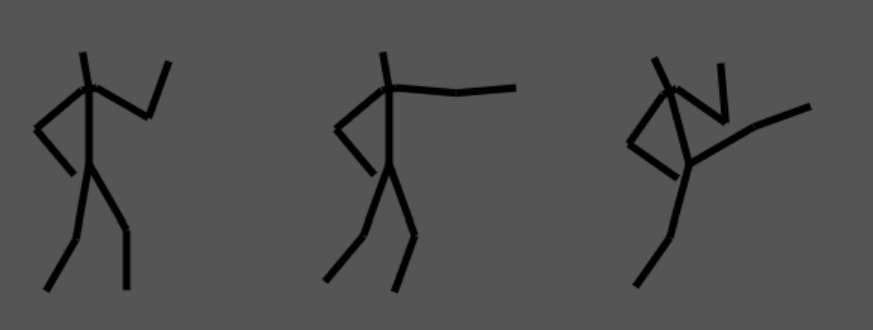
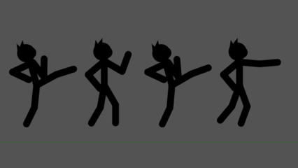
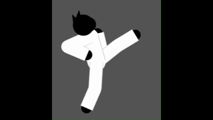
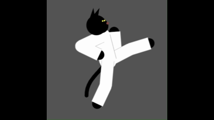
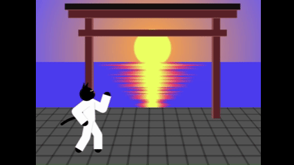
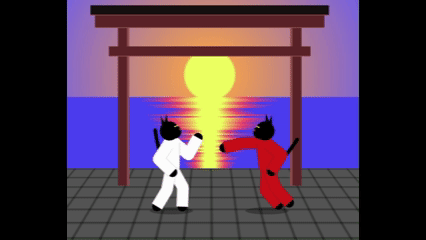
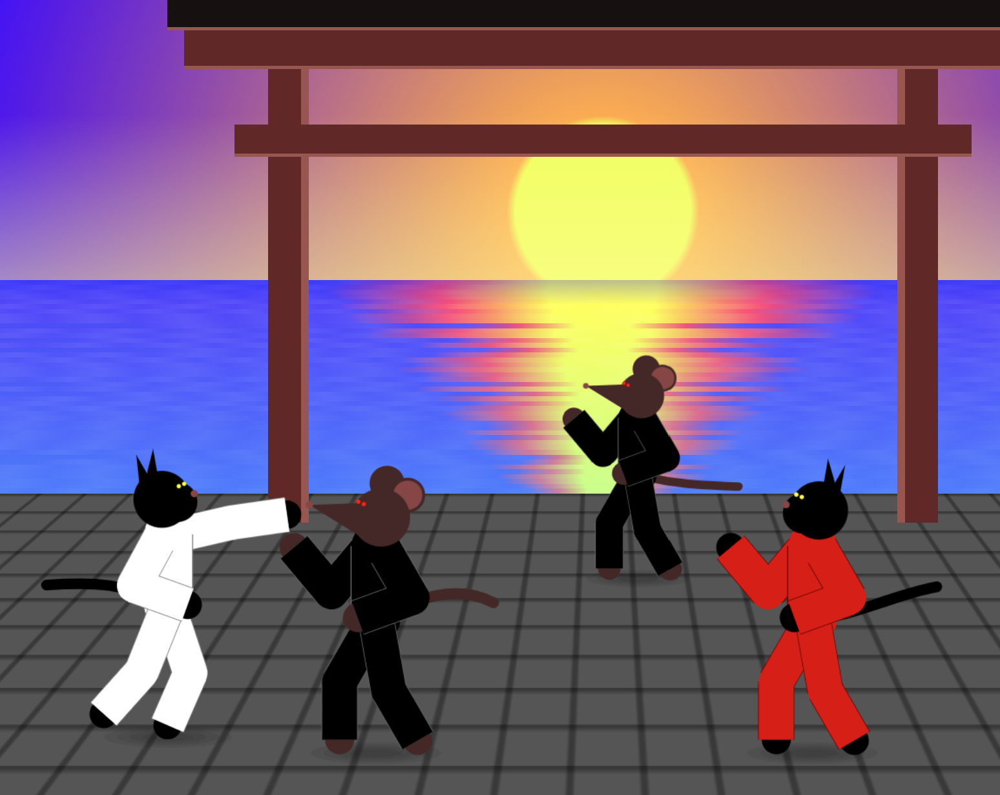
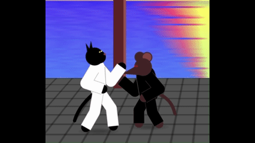

# DEVLOG

## 2025-08-13  

Theme announced: Black Cat

**Brainstoming game ideas:**

* ...
* 2d cat fighting game like interational karate plus, "Black Belt Cat" fighting ninjas

* implemented first sketch with stickfigures

**devtime:** 1h brainstoming during commute, 1h evening dev

## 2025-08-14 

* refactored posing to use definitions (only an angle for each bone)
* added morphing between poses

**devtime:** 1h dev during commute, 0.75h evening dev

## 2025-08-17

* added a suit 

* and a tail

**devtime:** 1.5h evening dev

## 2025-08-18

* added a background

**devtime:** 1.5h evening dev

## 2025-08-19

* added basic shadow (and prepared the cat for jumping)
* fixed rendering to be able to mirror the fighter

**devtime:** 1.5h evening dev

## 2025-08-20

* added basic keyboardinput support
* refactored class tree (GameObject, Cat, Player)

**devtime:** 1h evening dev

## 2025-08-21

* walking animation added
* poses are now managed by a morph-queue

**devtime:** 1.5h evening dev

## 2025-08-22

* music created (synthwave)

**devtime:** 3h evening

## 2025-08-23

* buildprocess added
* music playback added
* titlescreen added
* fake depth by sizing of the characters
* changed gameplay to beat-em-up
* renamed to Black Belt - Paws of Steel

**devtime:** 3h evening

## 2025-08-24

* renamed again: "Miami Mice" (idea from Alkor @ slack)
* renamed "cast": "Arnold Schwarzenmouser" and "Jean Claws van Damme" (ideas Alkor & Randy @ slack)
* added keycontrols for block, punch and kick

**devtime:** 1h morning, 1.5h evening

## 2025-08-25

* refactored cats implementing superclass KinematicObject
* added rats!

**devtime:** 2h evening

## 2025-08-26

* added hitboxes
* made the postures of the rats more evil/agressive

**devtime:** 1.5h evening

## 2025-08-27

* added bone-animations for hits (configureable for each hitbox)

**devtime:** 0.5h workcommute, 1h evening

## 2025-08-28

* added an enemy-ki, they now move to the players area and dont overlap
* random gi- and fur-colors for the enemies

**devtime:** 0.5h workcommute, 1.5h evening

## 2025-08-29

* new character: the Rat King

**devtime:** 1.5h evening

## 2025-08-30

* started to add an intro

**devtime:** 1.5h evening

## 2025-08-31

* cutscene-support added

**devtime:** 2h afternoon

## 2025-09-01

* cutscene-support refactored
* enemy ki updated, to fight back
* ko-state of player added

**devtime:** 2h night

## 2025-09-03

* gameover screen + retry stage added
* stages are now linked (callback that checks if the stage is cleared and loads the next one)

**devtime:** 1.5h night
